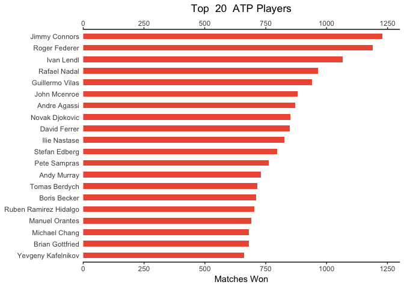

The [deuce](%22https://github.com/skoval/deuce%22) package for R includes the full listing of the ATP matches from 1968 until now. This post uses descriptive statistics to gain some insights about the evolution of ATP tennis in the last years. The code for the plot in this R Markdown isn't echoed, but if someone is insterested please leave a comment and I'll show it!

First of all, the dataset is in wide format, that is there's a line per match: I want to extract the matches in "long" format, with a line per player and with the indication if he has won or not (has\_won) cded as a numeric binary variable; this will help with regression. This data goes in *atp\_matches.long*.

``` r
library(deuce)
data("atp_matches")
output_names <- c("pid","pname","year","rank","opponent_id","opponent_name","opponent_rank")
tmp_w <- atp_matches[,c("winner_id","winner_name","year","winner_rank","loser_id","loser_name","loser_rank")]
names(tmp_w) <- output_names
tmp_w$has_won <- 1
tmp_l <- atp_matches[,c("loser_id","loser_name","year","loser_rank", "winner_id","winner_name","winner_rank")]
names(tmp_l) <- output_names
tmp_l$has_won <- 0
atp_matches.long <- rbind(tmp_w, tmp_l)
rm(tmp_w,tmp_l)
```

Let's use **pylr** and see who are the top 20 winning players of all times.

``` r
N <- 20
top_players <- head(  atp_matches.long %>% 
                      group_by(pid,pname) %>% 
                      filter(has_won == 1) %>% 
                      summarise(n = n()) %>% 
                      arrange(desc(n)), n = N)
```



now let's see the top players
=============================

atp\_matches.long %&gt;% group\_by(pid,pname) %&gt;% filter(has\_won == 1) %&gt;% count()
=========================================================================================

unique\_players &lt;- unique(all\_players\[c("pid","pname")\])
==============================================================

players\_stats &lt;- all\_players %&gt;% group\_by(pid,pname) %&gt;% summarise(min = min(year))
===============================================================================================

player\_stats\_per\_year
========================

players\_stats &lt;- merge(x=players\_stats, y=all\_players %&gt;% group\_by(pid,pname) %&gt;% summarise(max = max(year)))
==========================================================================================================================

players\_stats*w**i**n**s* &lt; −*a**l**l*<sub>*p*</sub>*l**a**y**e**r**s*losses &lt;- all\_players %&gt;% group\_by(pid,pname) %&gt;% count()
==============================================================================================================================================

df\_minYear &lt;- all\_players %&gt;% group\_by(pid) %&gt;% summarise(max = max(year))
======================================================================================

As a first graph, I'd like to see who are the top 20 winning players of all times. All the usual suspects are there.

I would like to check out quickly the distribution of players vs how many matches they won, notice that it follows a power-law distribution.
