WHAT IS CUSTOMER CHURN?
-----------------------

Customer churn refers to customers stopping the use of a service, switching to a competitor service, switching to a lower-tier experience in the service or reducing engagement with the service.

With easy communication and a number of service providers available in the telecommunication industry, almost everyone today has a telecom subscription. Churn is especially important to telecom service providers because it is easy for a subscriber to switch services.

Factors such as perceived frequent service disruptions, poor customer service experiences, and better offers from other competing carriers may cause a customer to churn (likely to leave).

WHY IS CUSTOMER CHURN IMPORTANT FOR TELECOM INDUSTRIES?
-------------------------------------------------------

Reducing customer churn is a key business goal of every telecom business. The ability to predict that a particular customer is at a high risk of churning, while there is still time to do something about it, represents a huge additional potential revenue source for every telecom business.

Besides the direct loss of revenue that results from a customer abandoning the business, the costs of initially acquiring that customer may not have already been covered by the customer's spending to date. (In other words, acquiring that customer may have actually been a losing investment.)

Furthermore, it is always more difficult and expensive to acquire a new customer than it is to retain a current paying customer.

HOW TO REDUCE CUSTOMER CHURN?
-----------------------------

In order to succeed at retaining customers who would otherwise abandon the business, marketers and retention, experts must be able to :

-   predict in advance which customers are going to churn through churn analysis, and

-   know which marketing actions will have the greatest retention impact on each particular customer.

Armed with this knowledge, a large proportion of customer churn can be eliminated.

HOW DOES PREDICTING CUSTOMER CHURN HELP?
----------------------------------------

Churn Prediction model can help analyze the historical data available with the business to find the list of customers which are at high risk to churn. This will help the telecom industry to focus on a specific group rather than using retention strategies on every customer.

Individualized customer retention is difficult because businesses usually have a big customer base and cannot afford to spend much time and money for it. However, if we could predict in advance which customers are at risk of leaving, we can reduce customer retention efforts by directing them solely toward such customers.

CUSTOMER CHURN ANALYSIS
-----------------------

The project will aim to analyze the data for a telecommunication company (intended client for the project), and predict in advance, which customers are likely to churn, based on the data analysis.

The goals of the analysis:

-   *acquire* a telecom company's dataset
-   perform *data wrangling* : clean the dataset and get it into a format amenable for analysis
-   perform *exploratory data analysis* : summarize and visualize important characteristics and statistical properties of the dataset
-   apply *machine learning* : in-depth data analysis, build models that predict the propensity of customers to churn, evaluate the results of models, and eventually, choose the best suitable predictive model to predict customers who may churn

*P.S. : The complete R code for this analysis can be found [here](https://github.com/singhaadrika/Springboard/blob/master/Capstone%20Project/Capstone%20Project%20Code.Rmd)*

DATASET ACQUISITION
-------------------

The data for this project comes from the data made available as a part of *[KDD Cup 2009: Customer Relationship prediction](http://www.kdd.org/kdd-cup/view/kdd-cup-2009/Intro)* :

-   [Train Data](http://www.kdd.org/cupfiles/KDDCupData/2009/orange_small_train.data.zip)
-   [Train Churn Labels](http://www.kdd.org/cupfiles/KDDCupData/2009/files/orange_small_train_churn.labels)

For analysis with R, the telecom company's training dataset is imported as a data frame.

Looking at the dimensions of the dataset :

    ## [1] 50000   231

Looking at the first 6 rows of some of the columns:

    ## # A tibble: 6 x 231
    ##    Var1  Var2  Var3  Var4  Var5  Var6  Var7 Var8   Var9 Var10 Var11 Var12
    ##   <int> <int> <int> <int> <int> <int> <int> <lgl> <int> <dbl> <int> <int>
    ## 1    NA    NA    NA    NA    NA  1526     7 NA       NA    NA    NA    NA
    ## 2    NA    NA    NA    NA    NA   525     0 NA       NA    NA    NA    NA
    ## 3    NA    NA    NA    NA    NA  5236     7 NA       NA    NA    NA    NA
    ## 4    NA    NA    NA    NA    NA    NA     0 NA       NA    NA    NA    NA
    ## 5    NA    NA    NA    NA    NA  1029     7 NA       NA    NA    NA    NA
    ## 6    NA    NA    NA    NA    NA   658     7 NA       NA    NA    NA    NA
    ## # ... with 219 more variables: Var13 <int>, Var14 <int>, Var15 <lgl>,
    ## #   Var16 <dbl>, Var17 <int>, Var18 <int>, Var19 <int>, Var20 <lgl>,
    ## #   Var21 <int>, Var22 <int>, Var23 <int>, Var24 <int>, Var25 <int>,
    ## #   Var26 <int>, Var27 <int>, Var28 <dbl>, Var29 <int>, Var30 <int>,
    ## #   Var31 <lgl>, Var32 <lgl>, Var33 <dbl>, Var34 <int>, Var35 <int>,
    ## #   Var36 <int>, Var37 <int>, Var38 <int>, Var39 <lgl>, Var40 <int>,
    ## #   Var41 <int>, Var42 <lgl>, Var43 <int>, Var44 <int>, Var45 <dbl>,
    ## #   Var46 <int>, Var47 <int>, Var48 <lgl>, Var49 <int>, Var50 <int>,
    ## #   Var51 <dbl>, Var52 <lgl>, Var53 <dbl>, Var54 <int>, Var55 <lgl>,
    ## #   Var56 <int>, Var57 <dbl>, Var58 <int>, Var59 <dbl>, Var60 <int>,
    ## #   Var61 <int>, Var62 <int>, Var63 <int>, Var64 <dbl>, Var65 <int>,
    ## #   Var66 <int>, Var67 <int>, Var68 <int>, Var69 <dbl>, Var70 <int>,
    ## #   Var71 <int>, Var72 <int>, Var73 <int>, Var74 <int>, Var75 <int>,
    ## #   Var76 <int>, Var77 <int>, Var78 <int>, Var79 <lgl>, Var80 <int>,
    ## #   Var81 <dbl>, Var82 <int>, Var83 <int>, Var84 <int>, Var85 <int>,
    ## #   Var86 <int>, Var87 <int>, Var88 <int>, Var89 <int>, Var90 <int>,
    ## #   Var91 <int>, Var92 <int>, Var93 <int>, Var94 <int>, Var95 <int>,
    ## #   Var96 <int>, Var97 <int>, Var98 <int>, Var99 <int>, Var100 <int>,
    ## #   Var101 <int>, Var102 <dbl>, Var103 <int>, Var104 <int>, Var105 <int>,
    ## #   Var106 <int>, Var107 <int>, Var108 <int>, Var109 <int>, Var110 <int>,
    ## #   Var111 <dbl>, Var112 <int>, …

### Dataset Information:

-   There are *50,000* observations of *231* variables in the dataset.
-   Each row corresponds to a unique customer.
-   From the dataset description, it is known that the first *190* variables are **numerical**, next *40* variables are **categorical**, and the last variable is the **binary** variable **churn**, which specifies whether a given customer churned or not.
-   The dataset fields contain information about several customer attributes.

### Limitations:

-   The variable fields are named as Var1, Var2, etc., which makes it difficult to identify which customer attribute is being looked at.
-   Similarly, the information contained in categorical variables seem to be coded, again making it to difficult to relate to the kind of information contained in these fields.
-   The dimensionality of the dataset is high (230 variables with 50000 observations), making it difficult to run certain transformations on the dataset, with the available infrastructural capacity.

CLEANING THE DATASET
--------------------

The first step in analyzing data is to clean the dataset and get it into a format amenable for analysis. As seen earlier, there are a lot of *missing values* in the dataset. Thus, the proportion of missing values per column is observed using a histogram.

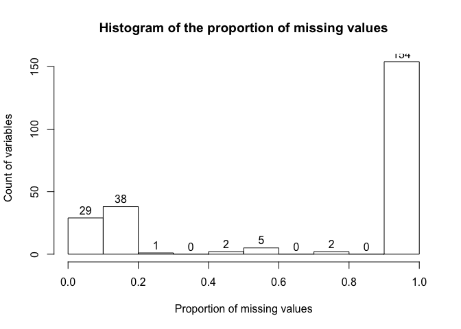

**<span style="color:darkred">Action</span>**:

-   the columns with more than 20% of the data missing, will be removed (most of the columns have more than 90% missing data, and otherwise, there are not many variables with missing values proportions between 20% - 80%), as these variables will not contribute much towards the final goal of prediction.

-   the variables with near-zero variance (such as columns having a unique value) will be removed, as they may not be useful for discriminating classes.

-   the resulting dataset columns will be renamed in order again, with the last column being churn.

-   the binary variable *churn* will be relabeled as No/Yes instead of 0/1.

Looking at the dimensions of the resulting dataset :

    ## [1] 50000    57

Looking at the first 6 rows of some of the columns:

    ## # A tibble: 6 x 57
    ##    Var6  Var7 Var13 Var21 Var22 Var24 Var25 Var28 Var35   Var38 Var57 Var65
    ##   <int> <int> <int> <int> <int> <int> <int> <dbl> <int>   <int> <dbl> <int>
    ## 1  1526     7   184   464   580    14   128 167.      0    3570 4.08      9
    ## 2   525     0     0   168   210     2    24 354.      0 4764966 5.41      9
    ## 3  5236     7   904  1212  1515    26   816 220.      0 5883894 6.60      9
    ## 4    NA     0     0    NA     0    NA     0  22.1     0       0 1.99      9
    ## 5  1029     7  3216    64    80     4    64 200       0       0 4.55     18
    ## 6   658     7  3156   224   280     2    72 200       5       0 0.166     9
    ## # ... with 45 more variables: Var73 <int>, Var74 <int>, Var76 <int>,
    ## #   Var81 <dbl>, Var83 <int>, Var85 <int>, Var109 <int>, Var112 <int>,
    ## #   Var113 <dbl>, Var119 <int>, Var123 <int>, Var125 <int>, Var132 <int>,
    ## #   Var133 <int>, Var134 <int>, Var144 <int>, Var149 <int>, Var153 <int>,
    ## #   Var160 <int>, Var163 <int>, Var192 <fct>, Var193 <fct>, Var197 <fct>,
    ## #   Var198 <fct>, Var199 <fct>, Var202 <fct>, Var203 <fct>, Var204 <fct>,
    ## #   Var205 <fct>, Var206 <fct>, Var207 <fct>, Var208 <fct>, Var211 <fct>,
    ## #   Var212 <fct>, Var216 <fct>, Var217 <fct>, Var218 <fct>, Var220 <fct>,
    ## #   Var221 <fct>, Var222 <fct>, Var223 <fct>, Var226 <fct>, Var227 <fct>,
    ## #   Var228 <fct>, churn <fct>

**<span style="color:blue">Result</span>**: The dataset now has only *57* variables, all of which have **less than 20%** missing data.

DEALING WITH MISSING DATA
-------------------------

Since missing data values can create problems for analyzing data and creating predictive models, they need to be treated. **Imputation** is the process for *substituting* missing data.

*Simple/single imputation methods* include replacing the missing value with the mean/median/mode of the variable. However, creating *multiple imputations* as compared to a single imputation (such as mean) takes care of uncertainty in missing values.

In bootstrapping, different bootstrap resamples are used for each of multiple imputations. Then, a flexible additive model (non parametric regression method) is fitted on samples taken with replacements from original data and missing values (acts as dependent variable) are predicted using non-missing values (independent variable).Then, it uses predictive mean matching (default) to impute missing values.

**<span style="color:darkred">Action</span>**:

-   For imputing the missing values for **numerical variables**, *mean imputation using additive regression, bootstrapping, and predictive mean matching* will be used.

-   For the variables that are heavily skewed and are excluded from the previous step, *median imputation* will be used to fill in the missing values.

-   For **categorical variables**, all the NA values will be replaced by another factor level called *Unknown*.

From the dataset, it is known, that the first 32 variables are numerical. Analyzing the summaries for these numerical variables :

``` r
# Analyze summary for numerical variables - I
summary(subset(telco, select = colnames(telco)[1:11]))
##        V1               V2                V3               V4         
##  Min.   :     0   Min.   :  0.000   Min.   :     0   Min.   :    0.0  
##  1st Qu.:   518   1st Qu.:  0.000   1st Qu.:     0   1st Qu.:  112.0  
##  Median :   861   Median :  7.000   Median :   232   Median :  144.0  
##  Mean   :  1326   Mean   :  6.809   Mean   :  1250   Mean   :  234.5  
##  3rd Qu.:  1428   3rd Qu.:  7.000   3rd Qu.:  1604   3rd Qu.:  228.0  
##  Max.   :131761   Max.   :140.000   Max.   :197872   Max.   :36272.0  
##  NA's   :5529     NA's   :5539      NA's   :5539     NA's   :5529     
##        V5                V6                V7                 V8         
##  Min.   :    0.0   Min.   :  0.000   Min.   :    0.00   Min.   : -66.88  
##  1st Qu.:  135.0   1st Qu.:  0.000   1st Qu.:   16.00   1st Qu.: 166.56  
##  Median :  180.0   Median :  2.000   Median :   48.00   Median : 220.08  
##  Mean   :  290.2   Mean   :  4.508   Mean   :   96.83   Mean   : 224.51  
##  3rd Qu.:  285.0   3rd Qu.:  6.000   3rd Qu.:  112.00   3rd Qu.: 266.40  
##  Max.   :45340.0   Max.   :494.000   Max.   :13168.00   Max.   :5158.56  
##  NA's   :5009      NA's   :7230      NA's   :5009       NA's   :5011     
##        V9               V10                V11          
##  Min.   :  0.000   Min.   :       0   Min.   :0.000214  
##  1st Qu.:  0.000   1st Qu.:    7794   1st Qu.:1.743164  
##  Median :  0.000   Median : 1290246   Median :3.514740  
##  Mean   :  0.717   Mean   : 2579107   Mean   :3.512311  
##  3rd Qu.:  0.000   3rd Qu.: 4570944   3rd Qu.:5.264741  
##  Max.   :110.000   Max.   :18846900   Max.   :7.000000  
##  NA's   :5009      NA's   :5009
# Analyze summary for numerical variables - II
summary(subset(telco, select = colnames(telco)[12:22]))
##       V12              V13              V14                V15          
##  Min.   :  9.00   Min.   :  4.00   Min.   :     0.0   Min.   :       0  
##  1st Qu.:  9.00   1st Qu.: 24.00   1st Qu.:     0.0   1st Qu.:   89360  
##  Median :  9.00   Median : 52.00   Median :     7.0   Median :  882000  
##  Mean   : 14.87   Mean   : 66.64   Mean   :   103.7   Mean   : 1490154  
##  3rd Qu.: 18.00   3rd Qu.:102.00   3rd Qu.:    84.0   3rd Qu.: 2309884  
##  Max.   :180.00   Max.   :264.00   Max.   :142156.0   Max.   :19353600  
##  NA's   :5539                      NA's   :5539       NA's   :5009      
##       V16               V17               V18                V19         
##  Min.   :      0   Min.   :   0.00   Min.   :   0.000   Min.   :   0.00  
##  1st Qu.:  16357   1st Qu.:   0.00   1st Qu.:   0.000   1st Qu.:  24.00  
##  Median :  73523   Median :  10.00   Median :   4.000   Median :  32.00  
##  Mean   : 103084   Mean   :  20.02   Mean   :   8.461   Mean   :  60.89  
##  3rd Qu.: 181977   3rd Qu.:  25.00   3rd Qu.:  10.000   3rd Qu.:  56.00  
##  Max.   :1814403   Max.   :6335.00   Max.   :1178.000   Max.   :7456.00  
##  NA's   :5529      NA's   :5009      NA's   :5009       NA's   :7230     
##       V20                V21                V22          
##  Min.   :    0.00   Min.   :-9803600   Min.   :     0.0  
##  1st Qu.:   16.00   1st Qu.: -182715   1st Qu.:   425.0  
##  Median :   40.00   Median :   29615   Median :   560.0  
##  Mean   :   66.22   Mean   : -153279   Mean   :   916.1  
##  3rd Qu.:   72.00   3rd Qu.:  147488   3rd Qu.:   895.0  
##  Max.   :10352.00   Max.   : 9932480   Max.   :105060.0  
##  NA's   :5009                          NA's   :5529
# Analyze summary for numerical variables - III
summary(subset(telco, select = colnames(telco)[23:32]))
##       V23                V24               V25               V26          
##  Min.   :    0.00   Min.   :      0   Min.   :  0.000   Min.   :       0  
##  1st Qu.:    6.00   1st Qu.:    234   1st Qu.:  0.000   1st Qu.:  216808  
##  Median :   30.00   Median :   6471   Median :  0.000   Median : 1479810  
##  Mean   :   60.19   Mean   :  27888   Mean   :  3.525   Mean   : 2273572  
##  3rd Qu.:   72.00   3rd Qu.:  31617   3rd Qu.:  0.000   3rd Qu.: 3604725  
##  Max.   :13086.00   Max.   :5436045   Max.   :184.000   Max.   :15009900  
##  NA's   :5009       NA's   :5539      NA's   :5009      NA's   :5009      
##       V27               V28             V29                V30          
##  Min.   :      0   Min.   : 0.00   Min.   :       0   Min.   :       0  
##  1st Qu.:  29808   1st Qu.: 0.00   1st Qu.:       0   1st Qu.: 1232346  
##  Median : 208928   Median : 9.00   Median :   51898   Median : 8131560  
##  Mean   : 437340   Mean   :11.73   Mean   :  294921   Mean   : 6181967  
##  3rd Qu.: 614884   3rd Qu.:18.00   3rd Qu.:  412113   3rd Qu.:10373380  
##  Max.   :5735340   Max.   :81.00   Max.   :16934400   Max.   :13907800  
##  NA's   :5009      NA's   :5529    NA's   :7230       NA's   :5009      
##       V31              V32          
##  Min.   :   0.0   Min.   :       0  
##  1st Qu.:  10.0   1st Qu.:       0  
##  Median :  22.0   Median :  134622  
##  Mean   :  38.8   Mean   :  486078  
##  3rd Qu.:  42.0   3rd Qu.:  615900  
##  Max.   :4862.0   Max.   :14515200  
##  NA's   :5009     NA's   :5009
```

**<span style="color:blue">Result</span>**: It can be seen, that, the variables *V9, V12 and V25* are heavily skewed, and therefore, median imputation will be used for these variables, to fill in the missing values.

Looking at the variables that have no missing values:

    ##  [1] "V11"   "V13"   "V21"   "V34"   "V36"   "V40"   "V43"   "V45"  
    ##  [9] "V46"   "V47"   "V50"   "V51"   "V52"   "V54"   "V55"   "V56"  
    ## [17] "churn"

Excluding the above variables, applying *median imputation* for skewed numerical variables, *multiple imputation* for the remaining numerical variables, and adding an "*Unknown*" factor level which replaces missing values in categorical variables, it is ensured that none of the variables in the dataset has missing values anymore:

``` r
# Names of the variables that may have missing values
names(telco[, checkNA != 0])
## character(0)
```

**<span style="color:blue">Result</span>**: Thus, the missing values for all the variables (numerical/categorical) have been imputed, and there are no features with missing values in the dataset.

EXPLORATORY DATA ANALYSIS
-------------------------

The next step in data analysis, which follows data wrangling, is exploratory data analysis, which refers to summarizing and visualizing important characteristics and statistical properties of the dataset.

Observing the distribution of customers between the classes *churned* and *not churned* :

### Distribution of people who churned

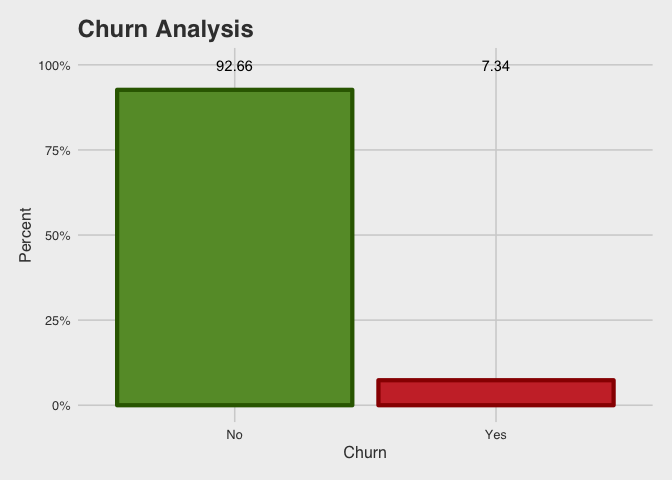

**<span style="color:blue">Finding</span>**: The percentage of people churning is much lower than the percentage of people not churning, which in turn, also implies, that the dataset is highly *imbalanced*.

### Categorical variables

Observing the categorical variables, and factor levels each one of them has:

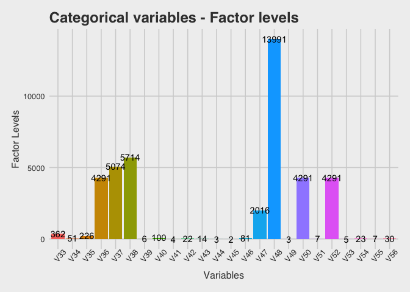

**<span style="color:blue">Finding</span>**: It can be observed that V36, V50, and V52 have the same number of factor levels (4291).

**<span style="color:darkred">Action</span>**: Creating mosaic plots to see the relationship between some of the categorical variables and the churn variable :

#### Relationship between V49 and whether the customer churned or not

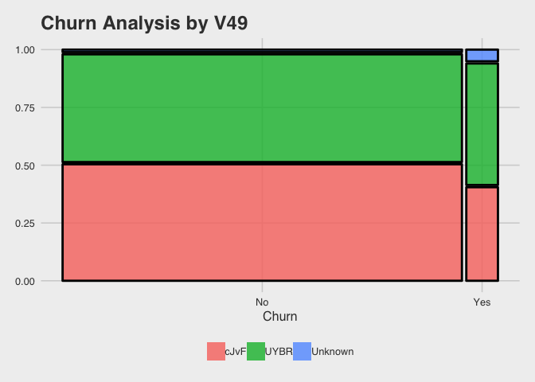 **<span style="color:blue">Finding</span>**: Based on this mosaic plot, it can be said that, given a customer churns, the V49 value is more likely to be **UYBR** than **cJvF**. Also, if V49 value is **Unknown**, then the customer is more likely to churn.

#### Relationship between V45 and whether the customer churned or not

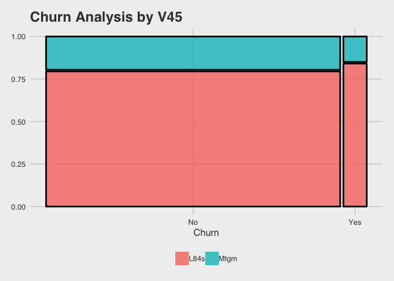 **<span style="color:blue">Finding</span>**: Similar to the previous plot, given a customer churns, the V45 value is more likely to be **L84s** than **Mtgm**.

#### Relationship between V41 and whether the customer churned or not

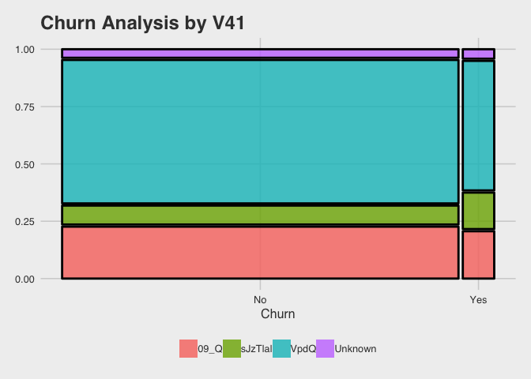 **<span style="color:blue">Finding</span>**: If V41 value is **sJzTIal**, then the customer is more likely to churn.

**<span style="color:darkred">Action</span>**: Based on the finding that V36, V50, and V52 have the same number of factor levels (4291), the association among these variables can be tested using Cramer's V.

**Cramer's V** is a measure of association between two nominal(having no order) variables, giving a value between 0 and +1 (inclusive; 0 suggesting no/weak association and 1 suggesting a strong association between the two variables). It is based on Pearson's chi-squared statistic.

Looking at the Cramer's V association value among these variables:

``` r
# Finding Cramer's V value between V36 and V50
cramersV(telco$V36, telco$V50)
## [1] 1
# Finding Cramer's V value between V36 and V52
cramersV(telco$V36, telco$V52)
## [1] 1
# Finding Cramer's V value between V50 and V52
cramersV(telco$V50, telco$V52)
## [1] 1
```

**<span style="color:blue">Finding</span>**: As observed, the variables have a very strong association (of Cramer's V = 1) with each other.

**<span style="color:darkred">Action</span>**: The three variables will be combined into one variable, and the factor levels for the resulting variable will be observed:

    ## [1] 4291

**<span style="color:blue">Finding</span>**: The newly merged column has the same number of factor levels (4291) as the original columns.

**<span style="color:darkred">Action</span>**:

-   the original variables will be removed; and the columns in the dataset will be reordered

-   create a dataframe *churnRel* which contains the Cramer's V value between each categorical variable and the variable *churn*.

-   filter the dataframe to find the variables that have a Cramer's V association value with churn variable, greater than 0.1.

-   keep these variables in the dataset, and discard the other categorical variables

-   rename the variables in proper order

Variables which have a better association with churn than other categorical variables, and will be kept in the dataset:

    ## [1] "V33" "V36" "V37" "V46" "V47" "V54"

Thus, we keep the above variables in the dataset, remove the other categorical variables, and rename the variables in proper order.

### Numerical variables

Observing the numerical variables, and unique values each one of them has:

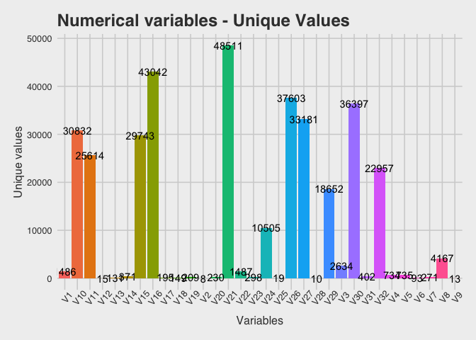 Presence of multicollinearity (predictors that are correlated with other predictors in the model, leading to unreliable and unstable estimates of regression coefficients) can degrade the quality of the model. **Thus, the following steps will help to reduce multi-collinearity**.

**<span style="color:blue">Finding</span>**: Based on bar chart, variables V4 and V5 have almost the same number of unique values. Similarly, variables V1 and V22 have almost the same number of unique values.

#### Comparing V4 and V5 against each other

    ## `geom_smooth()` using method = 'gam' and formula 'y ~ s(x, bs = "cs")'

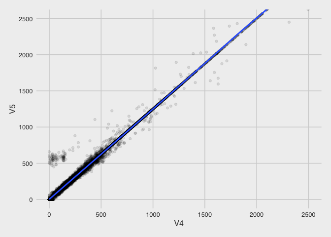 Correlation between V4 and V5:

    ## 
    ##  Pearson's product-moment correlation
    ## 
    ## data:  V4 and V5
    ## t = 5656.1, df = 49998, p-value < 0.00000000000000022
    ## alternative hypothesis: true correlation is not equal to 0
    ## 95 percent confidence interval:
    ##  0.9992057 0.9992330
    ## sample estimates:
    ##       cor 
    ## 0.9992195

#### Comparing V1 and V22 against each other

    ## `geom_smooth()` using method = 'gam' and formula 'y ~ s(x, bs = "cs")'

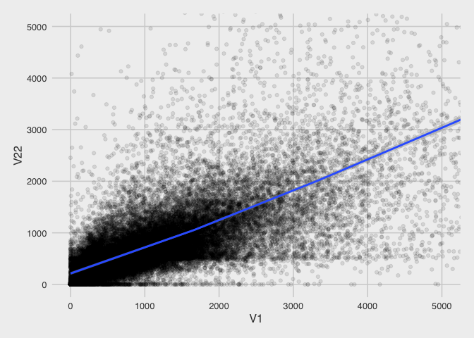 Correlation between V1 and V22:

    ## 
    ##  Pearson's product-moment correlation
    ## 
    ## data:  V1 and V22
    ## t = 245.98, df = 49998, p-value < 0.00000000000000022
    ## alternative hypothesis: true correlation is not equal to 0
    ## 95 percent confidence interval:
    ##  0.7359729 0.7439050
    ## sample estimates:
    ##       cor 
    ## 0.7399647

**<span style="color:blue">Finding</span>**: V4 and V5 have a high correlation of almost 1. V1 and V22 also have a high correlation of 0.74

**<span style="color:darkred">Action</span>**: Plotting the correlations among all numerical variables:

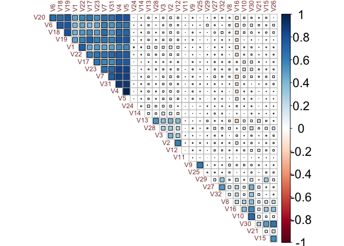 **Based on this correlation plot, the variable that has a higher correlation with *churn* variable, among a set of correlated numerical variables, will be kept in the dataset, and others will be discarded.**

**<span style="color:blue">Finding</span>**:

-   V9 and V25 seem to be highly correlated
-   V29 and V32 seem to be highly correlated
-   V1, V4, V5, V6, V7, V17, V18, V19, V20, V22, V23, and V31 seem to be highly correlated
-   V2, V3, V12, V13, and V28 seem to be highly correlated
-   V8, V10, V15, V16, V26, and V30 seem to be highly correlated

#### Comparing V9 and V25 against each other

    ## `geom_smooth()` using method = 'gam' and formula 'y ~ s(x, bs = "cs")'

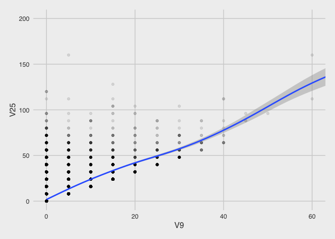

``` r
# Observe the correlation of these variables with churn and keep only the ones that have a higher correlation
with(telco, cor.test(V9, as.numeric(churn)))
## 
##  Pearson's product-moment correlation
## 
## data:  V9 and as.numeric(churn)
## t = 2.5961, df = 49998, p-value = 0.009432
## alternative hypothesis: true correlation is not equal to 0
## 95 percent confidence interval:
##  0.002844445 0.020372611
## sample estimates:
##        cor 
## 0.01160942
with(telco, cor.test(V25, as.numeric(churn)))
## 
##  Pearson's product-moment correlation
## 
## data:  V25 and as.numeric(churn)
## t = 2.4481, df = 49998, p-value = 0.01437
## alternative hypothesis: true correlation is not equal to 0
## 95 percent confidence interval:
##  0.00218262 0.01971105
## sample estimates:
##        cor 
## 0.01094767

# Remove V25
telco$V25 <- NULL
```

#### Comparing V29 and V32 against each other

    ## `geom_smooth()` using method = 'gam' and formula 'y ~ s(x, bs = "cs")'

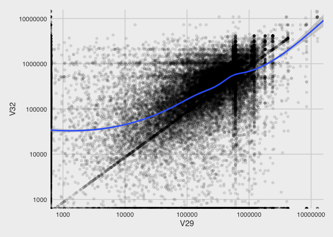

``` r
# Observe the correlation of these variables with churn and keeping only the ones that have a higher correlation
with(telco, cor.test(V29, as.numeric(churn)))
## 
##  Pearson's product-moment correlation
## 
## data:  V29 and as.numeric(churn)
## t = 1.5892, df = 49998, p-value = 0.112
## alternative hypothesis: true correlation is not equal to 0
## 95 percent confidence interval:
##  -0.00165835  0.01587129
## sample estimates:
##         cor 
## 0.007107017
with(telco, cor.test(V32, as.numeric(churn)))
## 
##  Pearson's product-moment correlation
## 
## data:  V32 and as.numeric(churn)
## t = 0.99846, df = 49998, p-value = 0.3181
## alternative hypothesis: true correlation is not equal to 0
## 95 percent confidence interval:
##  -0.004300131  0.013230047
## sample estimates:
##         cor 
## 0.004465301

# Remove V32
telco$V32 <- NULL
```

#### Comparing V1, V4, V5, V6, V7, V17, V18, V19, V20, V22, V23, and V31 against each other

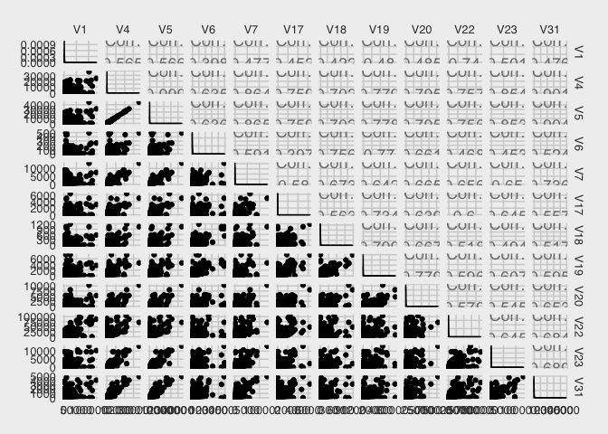

``` r
with(telco, cor.test(V1, as.numeric(churn)))
## 
##  Pearson's product-moment correlation
## 
## data:  V1 and as.numeric(churn)
## t = -4.0789, df = 49998, p-value = 0.00004531
## alternative hypothesis: true correlation is not equal to 0
## 95 percent confidence interval:
##  -0.026999889 -0.009475193
## sample estimates:
##         cor 
## -0.01823894
with(telco, cor.test(V4, as.numeric(churn)))
## 
##  Pearson's product-moment correlation
## 
## data:  V4 and as.numeric(churn)
## t = -2.0648, df = 49998, p-value = 0.03894
## alternative hypothesis: true correlation is not equal to 0
## 95 percent confidence interval:
##  -0.0179977633 -0.0004687301
## sample estimates:
##          cor 
## -0.009233956
with(telco, cor.test(V5, as.numeric(churn)))
## 
##  Pearson's product-moment correlation
## 
## data:  V5 and as.numeric(churn)
## t = -2.1136, df = 49998, p-value = 0.03455
## alternative hypothesis: true correlation is not equal to 0
## 95 percent confidence interval:
##  -0.0182158724 -0.0006869107
## sample estimates:
##          cor 
## -0.009452118
with(telco, cor.test(V6, as.numeric(churn)))
## 
##  Pearson's product-moment correlation
## 
## data:  V6 and as.numeric(churn)
## t = -2.6594, df = 49998, p-value = 0.00783
## alternative hypothesis: true correlation is not equal to 0
## 95 percent confidence interval:
##  -0.020655756 -0.003127707
## sample estimates:
##         cor 
## -0.01189264
with(telco, cor.test(V7, as.numeric(churn)))
## 
##  Pearson's product-moment correlation
## 
## data:  V7 and as.numeric(churn)
## t = -2.7856, df = 49998, p-value = 0.005345
## alternative hypothesis: true correlation is not equal to 0
## 95 percent confidence interval:
##  -0.021219762 -0.003691955
## sample estimates:
##         cor 
## -0.01245682
with(telco, cor.test(V17, as.numeric(churn)))
## 
##  Pearson's product-moment correlation
## 
## data:  V17 and as.numeric(churn)
## t = -0.30157, df = 49998, p-value = 0.763
## alternative hypothesis: true correlation is not equal to 0
## 95 percent confidence interval:
##  -0.010113811  0.007416685
## sample estimates:
##          cor 
## -0.001348666
with(telco, cor.test(V18, as.numeric(churn)))
## 
##  Pearson's product-moment correlation
## 
## data:  V18 and as.numeric(churn)
## t = -1.6019, df = 49998, p-value = 0.1092
## alternative hypothesis: true correlation is not equal to 0
## 95 percent confidence interval:
##  -0.015928335  0.001601293
## sample estimates:
##          cor 
## -0.007164071
with(telco, cor.test(V19, as.numeric(churn)))
## 
##  Pearson's product-moment correlation
## 
## data:  V19 and as.numeric(churn)
## t = -1.9484, df = 49998, p-value = 0.05137
## alternative hypothesis: true correlation is not equal to 0
## 95 percent confidence interval:
##  -0.01747728357  0.00005191335
## sample estimates:
##          cor 
## -0.008713355
with(telco, cor.test(V20, as.numeric(churn)))
## 
##  Pearson's product-moment correlation
## 
## data:  V20 and as.numeric(churn)
## t = -2.1816, df = 49998, p-value = 0.02914
## alternative hypothesis: true correlation is not equal to 0
## 95 percent confidence interval:
##  -0.0185200109 -0.0009911517
## sample estimates:
##          cor 
## -0.009756331
with(telco, cor.test(V22, as.numeric(churn)))
## 
##  Pearson's product-moment correlation
## 
## data:  V22 and as.numeric(churn)
## t = -2.5698, df = 49998, p-value = 0.01018
## alternative hypothesis: true correlation is not equal to 0
## 95 percent confidence interval:
##  -0.020254984 -0.002726771
## sample estimates:
##         cor 
## -0.01149176
with(telco, cor.test(V23, as.numeric(churn)))
## 
##  Pearson's product-moment correlation
## 
## data:  V23 and as.numeric(churn)
## t = 0.071894, df = 49998, p-value = 0.9427
## alternative hypothesis: true correlation is not equal to 0
## 95 percent confidence interval:
##  -0.008443764  0.009086762
## sample estimates:
##          cor 
## 0.0003215241
with(telco, cor.test(V31, as.numeric(churn)))
## 
##  Pearson's product-moment correlation
## 
## data:  V31 and as.numeric(churn)
## t = -3.1778, df = 49998, p-value = 0.001485
## alternative hypothesis: true correlation is not equal to 0
## 95 percent confidence interval:
##  -0.022972733 -0.005445745
## sample estimates:
##         cor 
## -0.01421033

# Remove all but V1
telco$V4 <- NULL
telco$V5 <- NULL
telco$V6 <- NULL
telco$V7 <- NULL
telco$V17 <- NULL
telco$V18 <- NULL
telco$V19 <- NULL
telco$V20 <- NULL
telco$V22 <- NULL
telco$V23 <- NULL
telco$V31 <- NULL
```

#### Comparing V2, V3, V12, V13, and V28 against each other

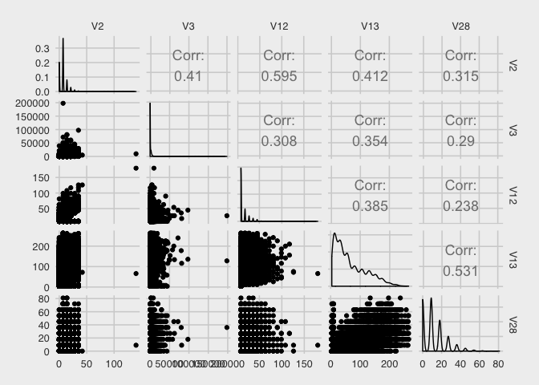

``` r
# Observe the correlation of these variables with churn and keeping only the ones that have a higher correlation
with(telco, cor.test(V2, as.numeric(churn)))
## 
##  Pearson's product-moment correlation
## 
## data:  V2 and as.numeric(churn)
## t = -14.551, df = 49998, p-value < 0.00000000000000022
## alternative hypothesis: true correlation is not equal to 0
## 95 percent confidence interval:
##  -0.07366089 -0.05620428
## sample estimates:
##         cor 
## -0.06493755
with(telco, cor.test(V3, as.numeric(churn)))
## 
##  Pearson's product-moment correlation
## 
## data:  V3 and as.numeric(churn)
## t = -9.1247, df = 49998, p-value < 0.00000000000000022
## alternative hypothesis: true correlation is not equal to 0
## 95 percent confidence interval:
##  -0.04952155 -0.03202017
## sample estimates:
##         cor 
## -0.04077399
with(telco, cor.test(V12, as.numeric(churn)))
## 
##  Pearson's product-moment correlation
## 
## data:  V12 and as.numeric(churn)
## t = -7.1892, df = 49998, p-value = 0.0000000000006606
## alternative hypothesis: true correlation is not equal to 0
## 95 percent confidence interval:
##  -0.04088906 -0.02337663
## sample estimates:
##         cor 
## -0.03213531
with(telco, cor.test(V13, as.numeric(churn)))
## 
##  Pearson's product-moment correlation
## 
## data:  V13 and as.numeric(churn)
## t = -15.135, df = 49998, p-value < 0.00000000000000022
## alternative hypothesis: true correlation is not equal to 0
## 95 percent confidence interval:
##  -0.07625441 -0.05880383
## sample estimates:
##         cor 
## -0.06753428
with(telco, cor.test(V28, as.numeric(churn)))
## 
##  Pearson's product-moment correlation
## 
## data:  V28 and as.numeric(churn)
## t = -10.243, df = 49998, p-value < 0.00000000000000022
## alternative hypothesis: true correlation is not equal to 0
## 95 percent confidence interval:
##  -0.05450443 -0.03701061
## sample estimates:
##         cor 
## -0.04576103

# Remove all but V13
telco$V2 <- NULL
telco$V3 <- NULL
telco$V12 <- NULL
telco$V28 <- NULL
```

#### Comparing V8, V10, V15, V16, V26, and V30 against each other

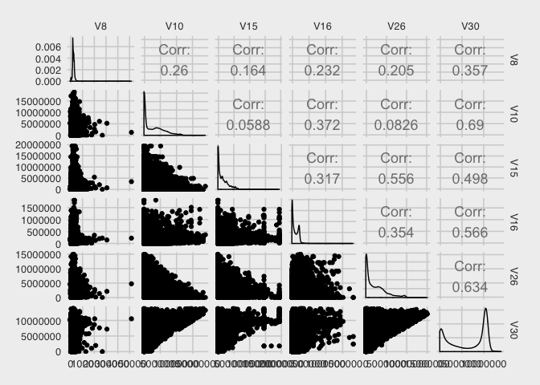

``` r
# Observe the correlation of these variables with churn and keeping only the ones that have a higher correlation 
with(telco, cor.test(V8, as.numeric(churn)))
## 
##  Pearson's product-moment correlation
## 
## data:  V8 and as.numeric(churn)
## t = 3.9288, df = 49998, p-value = 0.00008547
## alternative hypothesis: true correlation is not equal to 0
## 95 percent confidence interval:
##  0.008804045 0.026329162
## sample estimates:
##        cor 
## 0.01756795
with(telco, cor.test(V10, as.numeric(churn)))
## 
##  Pearson's product-moment correlation
## 
## data:  V10 and as.numeric(churn)
## t = 1.69, df = 49998, p-value = 0.09103
## alternative hypothesis: true correlation is not equal to 0
## 95 percent confidence interval:
##  -0.001207437  0.016322090
## sample estimates:
##         cor 
## 0.007557907
with(telco, cor.test(V15, as.numeric(churn)))
## 
##  Pearson's product-moment correlation
## 
## data:  V15 and as.numeric(churn)
## t = 1.9506, df = 49998, p-value = 0.05111
## alternative hypothesis: true correlation is not equal to 0
## 95 percent confidence interval:
##  -0.00004196349  0.01748723038
## sample estimates:
##         cor 
## 0.008723304
with(telco, cor.test(V16, as.numeric(churn)))
## 
##  Pearson's product-moment correlation
## 
## data:  V16 and as.numeric(churn)
## t = 7.8204, df = 49998, p-value = 0.000000000000005369
## alternative hypothesis: true correlation is not equal to 0
## 95 percent confidence interval:
##  0.02619585 0.04370497
## sample estimates:
##        cor 
## 0.03495309
with(telco, cor.test(V26, as.numeric(churn)))
## 
##  Pearson's product-moment correlation
## 
## data:  V26 and as.numeric(churn)
## t = 1.1273, df = 49998, p-value = 0.2596
## alternative hypothesis: true correlation is not equal to 0
## 95 percent confidence interval:
##  -0.003723765  0.013806317
## sample estimates:
##         cor 
## 0.005041663
with(telco, cor.test(V30, as.numeric(churn)))
## 
##  Pearson's product-moment correlation
## 
## data:  V30 and as.numeric(churn)
## t = 2.5846, df = 49998, p-value = 0.009753
## alternative hypothesis: true correlation is not equal to 0
## 95 percent confidence interval:
##  0.002792944 0.020321130
## sample estimates:
##        cor 
## 0.01155792

# Remove all but V16
telco$V8 <- NULL
telco$V10 <- NULL
telco$V15 <- NULL
telco$V26 <- NULL
telco$V30 <- NULL
```

Looking at the dimensions of the dataset :

    ## [1] 50000    17

Looking at the first 6 rows of some of the columns:

    ## # A tibble: 6 x 17
    ##      V1    V9   V11   V13   V14    V16     V21   V24    V27    V29 V33  
    ##   <dbl> <int> <dbl> <int> <dbl>  <dbl>   <dbl> <dbl>  <dbl>  <dbl> <fct>
    ## 1  1526     0 4.08     36    35 7.33e3  1.18e5   720  69134 397579 bZkv…
    ## 2   525     0 5.41     26     0 1.51e5 -3.56e5     0 357038 278334 CEat…
    ## 3  5236     0 6.60    130   518 1.62e4  4.05e5  5967 248932 320565 eOQt…
    ## 4     0     0 1.99     12     0 1.70e4 -2.76e5     0      0      0 jg69…
    ## 5  1029     0 4.55     82   224 3.74e4  1.07e4 15111  66046 267162 IXSg…
    ## 6   658     5 0.166   126   196 1.14e4  3.70e5  1935  43684   2639 m9Sr…
    ## # ... with 6 more variables: V34 <fct>, V35 <fct>, V36 <fct>, V37 <fct>,
    ## #   V38 <fct>, churn <fct>

Rename the variables, and look at the first 6 rows again:

    ## # A tibble: 6 x 17
    ##      V1    V2    V3    V4    V5     V6      V7    V8     V9    V10 V11  
    ##   <dbl> <int> <dbl> <int> <dbl>  <dbl>   <dbl> <dbl>  <dbl>  <dbl> <fct>
    ## 1  1526     0 4.08     36    35 7.33e3  1.18e5   720  69134 397579 bZkv…
    ## 2   525     0 5.41     26     0 1.51e5 -3.56e5     0 357038 278334 CEat…
    ## 3  5236     0 6.60    130   518 1.62e4  4.05e5  5967 248932 320565 eOQt…
    ## 4     0     0 1.99     12     0 1.70e4 -2.76e5     0      0      0 jg69…
    ## 5  1029     0 4.55     82   224 3.74e4  1.07e4 15111  66046 267162 IXSg…
    ## 6   658     5 0.166   126   196 1.14e4  3.70e5  1935  43684   2639 m9Sr…
    ## # ... with 6 more variables: V12 <fct>, V13 <fct>, V14 <fct>, V15 <fct>,
    ## #   V16 <fct>, churn <fct>

MACHINE LEARNING
----------------

The final step is to apply *machine learning*, which involves an in-depth data analysis. This step involves building models that predict the propensity of customers to churn, evaluating the results of models, and eventually, choosing the best suitable predictive model to predict customers who may churn.

As the problem aims to predict a binary variable **churn** (Yes/No), a classification model should be applied. Since the model will learn from a training set and predict for a test dataset thereafter, it is a supervised model.

Thus, the entire dataset will be **split** into a training set (train) and a testing set (test) in a **7:3** ratio, such that the distribution of the *churn* variable remains the same as before, for both of the resulting datasets.

**<span style="color:darkred">Action</span>**: As was observed from the exploratory data analysis, the dataset is highly **imbalanced**. Therefore, **Synthetic Minority Over-Sampling Technique (SMOTE)** will be used, to oversample (increase the number of) minority/ under-represented class, and undersample the majority class, so as to strike a balance between the two classes in the training dataset.

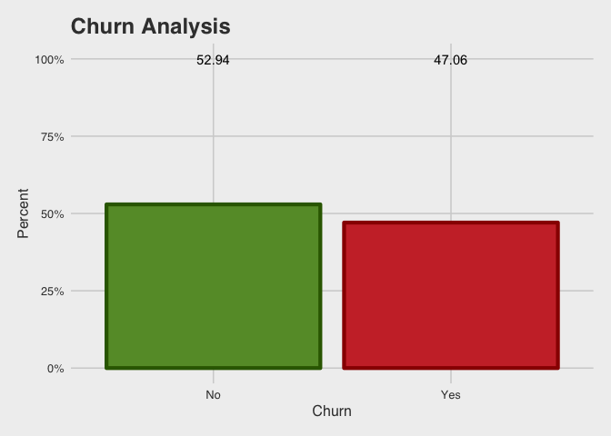 **<span style="color:blue">Finding</span>**: The dataset appears to be somewhat balanced after SMOTE, with nearly a 50:50 ratio.

**<span style="color:darkred">Action</span>**: **One hot encoding** is a process by which each factor for each categorical variable is converted into a binary variable, so that it could be provided to ML algorithms to do a better job in prediction. Thus, one-hot encoding is done on the dataset to create a sparse matrix:

    ## 6 x 31453 sparse Matrix of class "dgCMatrix"
    ##    [[ suppressing 31 column names 'V1', 'V2', 'V3' ... ]]
    ##                                                                           
    ## 1 1232 . 2.236488   6   . 245129.10 -2286936.0  23679  931422 604800 . . .
    ## 2  868 . 5.855586  52   . 201369.90    56456.4   8307  618608      . . . .
    ## 3  749 . 2.964110  48  28 224232.90   333234.8 111915       .      . . . .
    ## 4 1001 . 6.753258 208 259 149497.80    64798.4  70920 1369246 186452 . . .
    ## 5 2086 . 3.124332 198 182  59734.80   114760.4  57591 1171234 742049 . . .
    ## 6  721 . 5.665029  68 133   7683.93     5452.0   1098  117738  32648 . . .
    ##                                             
    ## 1 . . . . . . . . . . . . . . . . . . ......
    ## 2 . . . . . . . . . . . . . . . . . . ......
    ## 3 . . . . . . . . . . . . . . . . . . ......
    ## 4 . . . . . . . . . . . . . . . . . . ......
    ## 5 . . . . . . . . . . . . . . . . . . ......
    ## 6 . . . . . . . . . . . . . . . . . . ......
    ## 
    ##  .....suppressing columns in show(); maybe adjust 'options(max.print= *, width = *)'
    ##  ..............................

### XGBOOST MODEL

XGBoost is an implementation of gradient boosted decision trees designed for speed and performance. Gradient boosting involves three elements:

-   a loss function to be optimized

-   a weak learner to make predictions, and

-   an additive model to add weak learners to minimize the loss function.

**<span style="color:darkred">Action</span>**: Create a XGBoost model, and plot feature importance plot to see the 15 most important features, as per the model:

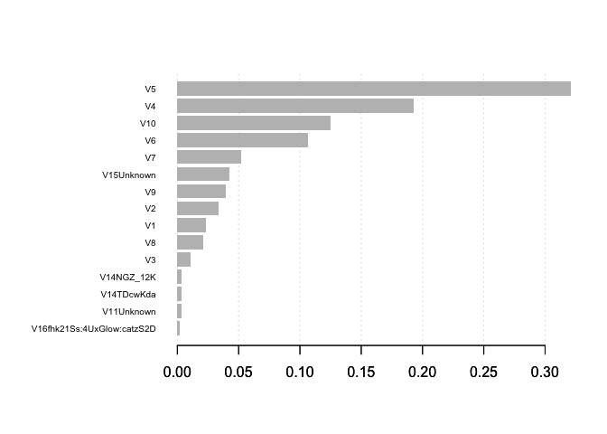 **<span style="color:darkred">Action</span>**: Use the XGBoost model for prediction on the test set, store the result in a confusion matrix, and view the resulting confusion matrix:

    ##               
    ##                Will Not Churn Will Churn
    ##   Didn't Churn           8753       5145
    ##   Churned                 535        567

### RANDOM FOREST MODEL

Random forests are ensemble learning methods which create multiple decision trees at the time of training, and outputs the class that is the mode of the classes, for classification models.

For the purpose of this analysis, three random forest models will be created and compared against each other and the XGboost model, to select the best model at the end of the analysis.

#### RANDOM FOREST MODEL 1

**<span style="color:darkred">Action</span>**: Since the randomForest function from randomForest package can't handle categorical predictors with more than 53 categories, we create a dataframe which only contains variables upto 53 categorical factor levels. We then create the Random Forest model, use it for prediction on the test set, store the result in a confusion matrix, and view the resulting confusion matrix:

    ##               
    ##                Will Not Churn Will Churn
    ##   Didn't Churn          11416       2482
    ##   Churned                 837        265

**<span style="color:darkred">Action</span>**: Plot variable importance plot to select the top variables, as per the model:

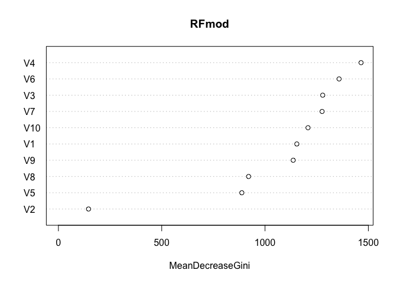

#### RANDOM FOREST MODEL 2

**<span style="color:darkred">Action</span>**: Based on the above variable importance plot, the top 7 variables are selected, and the second random forest model is fit:

    ## Random Forest 
    ## 
    ## 21845 samples
    ##     7 predictor
    ##     2 classes: 'No', 'Yes' 
    ## 
    ## No pre-processing
    ## Resampling: Cross-Validated (5 fold, repeated 3 times) 
    ## Summary of sample sizes: 17476, 17476, 17476, 17476, 17476, 17476, ... 
    ## Resampling results across tuning parameters:
    ## 
    ##   mtry  AUC        Precision  Recall     F        
    ##   2     0.9054970  0.8184450  0.8377000  0.8279256
    ##   4     0.9015048  0.8205080  0.8316472  0.8260046
    ##   7     0.8955830  0.8188813  0.8281885  0.8234700
    ## 
    ## F was used to select the optimal model using the largest value.
    ## The final value used for the model was mtry = 2.

**<span style="color:darkred">Action</span>**: Use the Random Forest model for prediction on the test set, store the result in a confusion matrix, and view the resulting confusion matrix:

    ##               
    ##                Will Not Churn Will Churn
    ##   Didn't Churn          10852       3046
    ##   Churned                 795        307

#### RANDOM FOREST MODEL 3

**<span style="color:darkred">Action</span>**: Based on the feature importance plots from both XGBoost and the first Random forest model, some additional variables are included in the model, and the third random forest model is fit:

    ## Random Forest 
    ## 
    ## 21845 samples
    ##     9 predictor
    ##     2 classes: 'No', 'Yes' 
    ## 
    ## No pre-processing
    ## Resampling: Cross-Validated (5 fold, repeated 3 times) 
    ## Summary of sample sizes: 17476, 17476, 17476, 17476, 17476, 17476, ... 
    ## Resampling results across tuning parameters:
    ## 
    ##   mtry  AUC        Precision  Recall     F        
    ##   2     0.9195678  0.8288565  0.8608733  0.8445336
    ##   5     0.9146907  0.8309384  0.8542729  0.8424057
    ##   9     0.9096066  0.8291372  0.8500072  0.8394158
    ## 
    ## F was used to select the optimal model using the largest value.
    ## The final value used for the model was mtry = 2.

**<span style="color:darkred">Action</span>**: Use the Random Forest model for prediction on the test set, store the result in a confusion matrix, and view the resulting confusion matrix:

    ##               
    ##                Will Not Churn Will Churn
    ##   Didn't Churn          11352       2546
    ##   Churned                 823        279

MODEL EVALUATION
----------------

The predictive models will be compared on the basis of following metrics:

-   Precision (Positive Predictive Value) : Of those classified as *Will churn*, what proportion actually did?
-   Recall (True Positive Rate) : Of those that in fact Churned, what proportion were classified that way?
-   Accuracy : Calculated as the number of all correct predictions divided by the total number of the dataset values.
-   F Score : harmonic mean of precision and recall (so as to balance both accordingly)

Comparing the models, we observe:

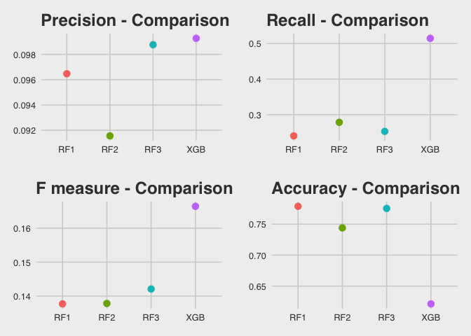 As the analysis aims to predict most of the customers who are at a high risk of churning, with high confidence, the model with a **higher precision value** than others should be selected.

**<span style="color:blue">Finding</span>**: Based on the precision, recall, F-measure, and accuracy values, as observed from the above graph, **XGBoost model** seems to be the best suitable model for prediction.

CONCLUSION
----------

-   The dataset was acquired from *[KDD Cup 2009: Customer Relationship prediction](http://www.kdd.org/kdd-cup/view/kdd-cup-2009/Intro)*

-   Data wrangling was performed, missing values were tackled, and the dataset was reformatted into an amenable form for further analysis

-   Exploratory data analysis was performed, and important characteristics and statistical properties of the dataset were summarized and visualized

-   An in-depth data analysis of the dataset was done through machine learning, models were built to predict the propensity of customers to churn, and the models were evaluated on the basis of suitable metrics

-   Based on the evaluation of the models, **XGBoost** model was found to be the best suitable model to predict customers with a high risk of churning

-   The results obtained have been optimized within the scope of this project; however, the model is not very confident about the predictions it makes about the customers, concluding that the analysis had a negative outcome

FURTHER RESEARCH
----------------

-   **Dimensionality Reduction** : Since the dataset has a high dimensionality, the results can be further improved by using methods such as PCA, which are aimed towards dimensionality reduction

-   **Feature Selection** : Again, to reduce dimensionality, another probable approach is to apply feature selection methods, using Lasso, FOBA, etc., to only keep the variables that are most suitable for prediction

RECOMMENDATIONS
---------------

-   Discussed in the exploratory data analysis section, there are several attributes and factors that might cause a customer to churn. For instance, if V41 value is sJzTIal, then the customer is more likely to churn. This can cause the business to identify the problem with this scenario of V41, and take effective actions to reduce the churn among customers.

-   Even though the model has low precision value, it has a moderate recall value, suggesting that even though the confidence with which the model predicts the high risk customers is low, it still reduces the customer retention efforts by directing them solely towards a smaller customer base, rather than focusing on the entire customer base.
